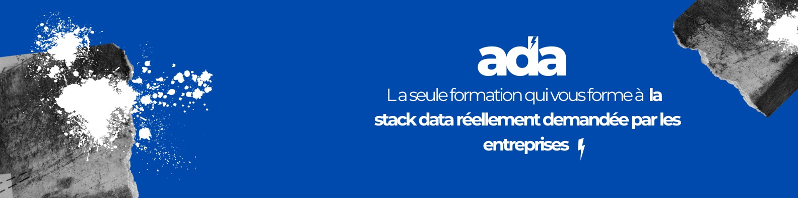

Pour rejoindre notre formation, direction notre plateforme [Ada](https://www.ada-study.com)

# Cours Python avancé

## Pré-requis
Ce cours fait suite à notre premier cours Python pour la data qui introduit les bases de la programmation en Python. Pour
suivre ce cours correctement, il est trés fortement conseillé que vous soyez à l'aise avec les concepts de:
- variable
- type de variable (`list`, `int`, `double`, `string`)
- listes et dictionnaires
- fonctions

## Contenu et but du cours
Dans ce cours, nous nous proposons d'écrire un code professionnel et bien organisé afin de télécharger des données d'un
ensemble d'API et les stocker dans une base de données [DuckDB](https://duckdb.org/). 

Le programme peut se résumer aux concepts suivants:
- Les modules: organiser son code en modules et packages
- Les classes: méthodes, attributs, héritage, dataclass, classes abstraites...etc
- Le block `try-except-finally`
- Le block `__name__ == __main__`
- Les context managers
- Les indices de type (ou __type hinting__)
- Les tests unitaires
- La qualité de code avec les _linters_ automatiques

## Approche
Notre approche peut se résumer avec la phrase: __apprendre par la pratique__.

Dans notre cours, on prend le pari de faire apparaître les concepts théoriques de classes et héritage (par exemple) comme
une évidence dans le code qu'on écrit plutôt que de parler d'objets qui représente un canard ou une voiture. Nous pensons
que ces exemples n'aident pas l'apprenant à voir leur application dans le monde des data et surtout n'expliquent pas quand
utiliser une classe est nécessaire vs simplement écrire un module.

Ainsi, guidé par les vidéos de notre cours et en utilisant ce repo et ses nombreuses branches, vous verrez les concepts
apparaître comme des évidences et comprendrez beaucoup mieux quand les utiliser.

Le désavantage? Il vous faudra beaucoup de pratique pour avoir assez de recul et comprendre ainsi les subtilités de tous 
ces concepts. C'est pour cela que ce cours est truffé d'exercices et inclut 2 projets finaux d'application.
